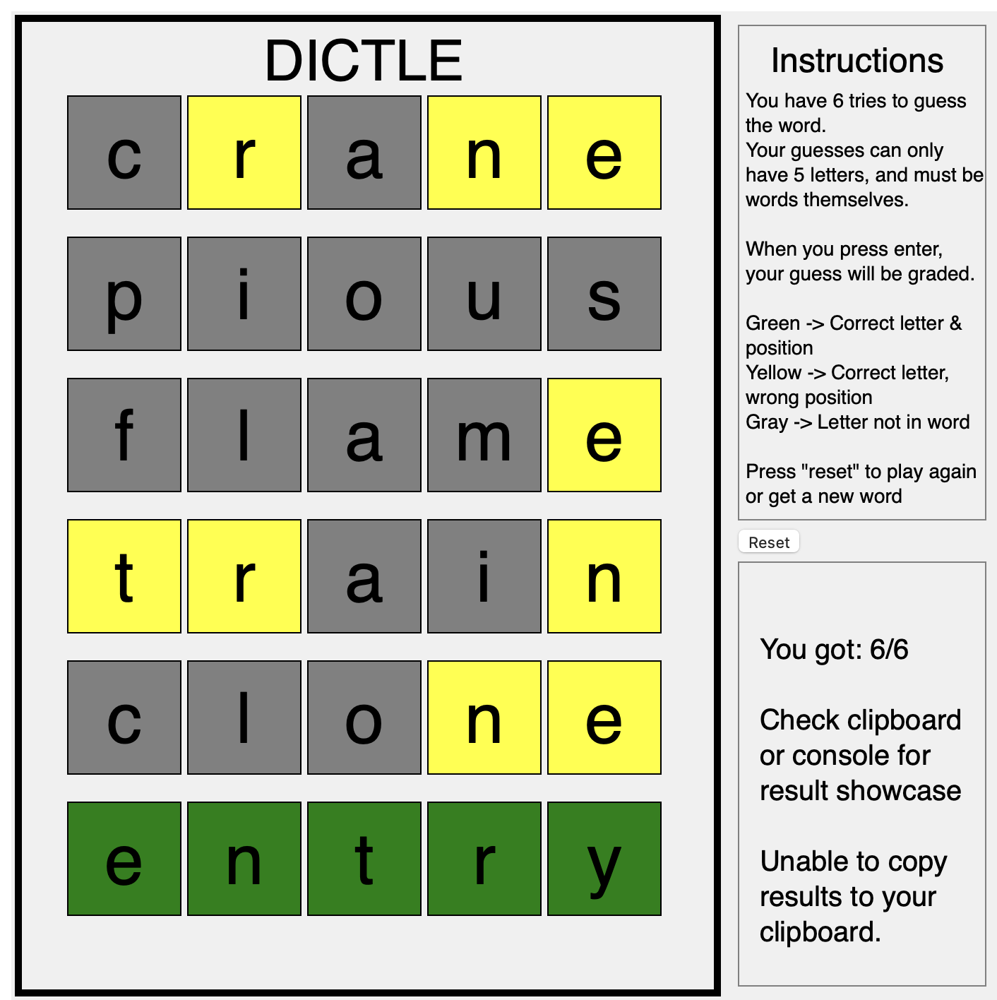

# AP CSP: Create Performance Task

## Task
Students will develop a computer program of their choice. Students need at least 12 hours of in-class time to complete.

## My Project
I made a clone of Wordle, called Dictle.

## Copyright
The task belong to the College Board. The assignment work was made by me (the author of this repo).