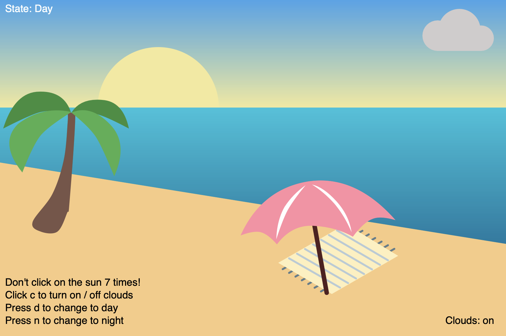

# Programming Assignment 2

## Task
Create a program that recreates a work of art / image / movie scene (school appropriate) etc, but includes movement / allows the user to interact (no games).

## Assignment Criteria
Create your program using everything that you have learned:
- Documentation (Header, Comments, indenting, spacing etc)
- Input (keyboard/mouse) and Output (the sketch)
- Variables (built in and custom)
- If statements (including else if, else, &&, ||, <, > etc)

## My Project
I made an interactable beach. 

## Copyright
The task and assignment criteria belong to my Computer Science teacher. The assignment work was made by me (the author of this repo).