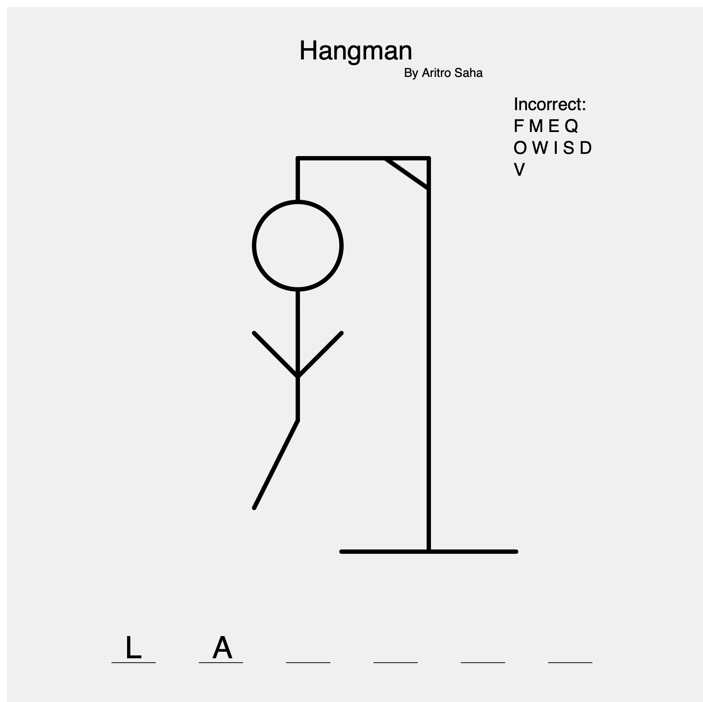

# Programming Assignment 2: Loops

## Outline
Create a program that includes the use of Arrays and Functions that meets the requirements of the AP CSP Create Task.

Your program can be anything you want (occupation, story, game etc).  But you will NOT be able to use this program (or any components) for your Create Task.

You will be evaluated on (ICS 2O0 material):
- Loops
- Any Assignment 1 criteria you wish to have re-assessed.  See bottom of document for how this will work (optional).
You will not be evaluated on (AP Material):
- Arrays
- Functions

## My Project
I made Hangman for this assignment, which can be seen below.

## Copyright
The outline belongs to my Computer Science teacher. The assignment work was made by me (the author of this repo).
