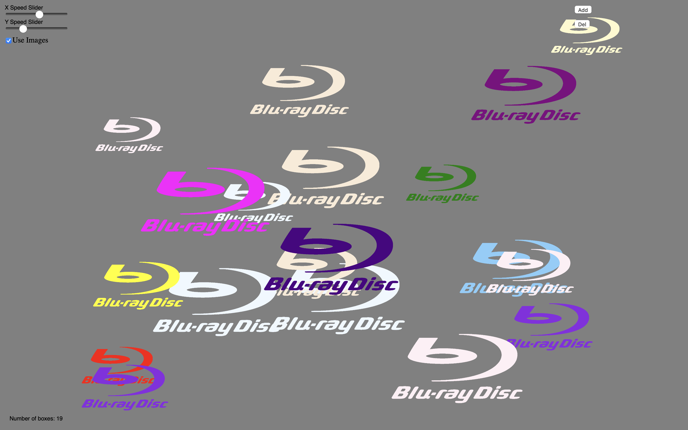

# Programming Culminating

## Task
Create a basic program that is responsive to the screen's size.

## Assignment Criteria
You program will contain the following:
- Documentation (header and comments)
- Input/Output¹
- Variables (creating, manipulating, proper naming)
- If Statements (if/else if/else, &&/||)
- Loops (for and while)

¹ The output can be very basic shapes etc, however the program must be responsive to the window size!

## My Project
I made a program with multiple bouncing Blu-Ray logos that can be customized.

## Copyright
The task belongs to my Computer Science teacher. The assignment work was made by me (the author of this repo).